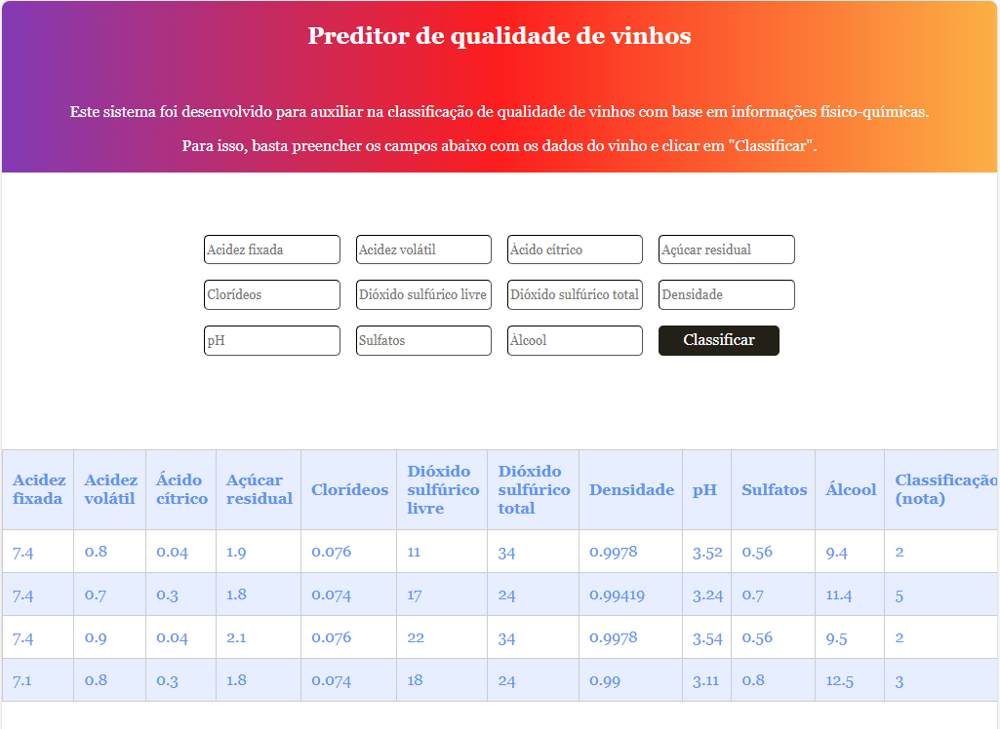

# Front

Este projeto faz partedo MVP da Disciplina **Qualidade de software e sistemas inteligentes** da PUC Rio

O objetivo é disponibilizar uma interação com o modelo de Machine Learning para classificação de vinhos.

---
## Como executar

Basta fazer o download do projeto e abrir o arquivo index.html no seu browser.

# API

O projeto consiste em encapsular o modelo de Machine Learning Extra Tree Classifier (ET) com um dataset de propriedades físico-químicas de vinhos, para predizer a qualidade de um novo vinho via input  na API.

A URI obtida dos dados sem tratamento está em: https://archive.ics.uci.edu/dataset/186/wine+quality. Informações mais detalhadas no arquito notebook disponível em: api/MachineLearning/notebooks.

---
## Como executar

É preciso ter um ambiente virtual python para executar a api. (Utilizei venv).

- Na pasta api/ e com o ambiente virtual ativado, execute:

`pip instal -r requirements.txt`

- Execute o projeto flask:

`run --host 0.0.0.0 --port 5000`

- Para rodar o teste de acurácia do modelo:

`pytest -v test_modelos.py`

